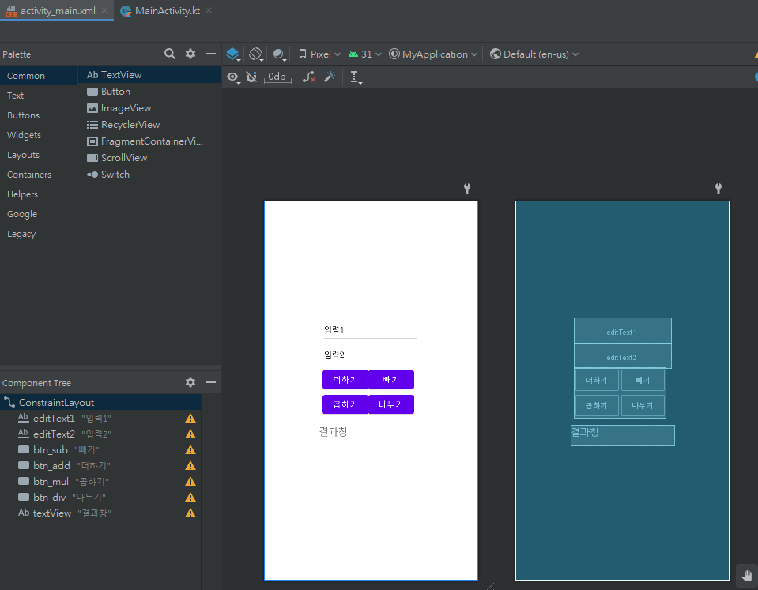
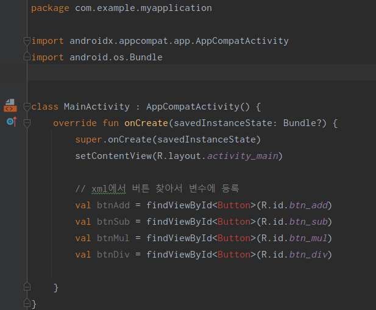
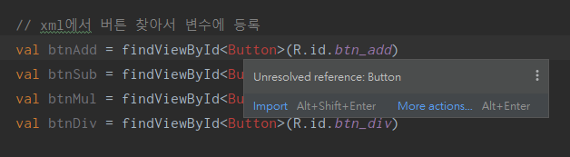
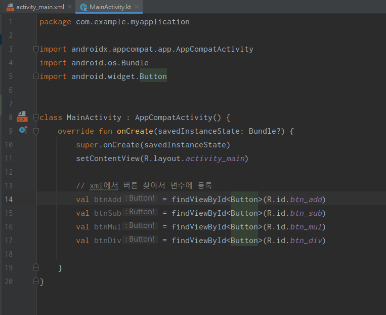
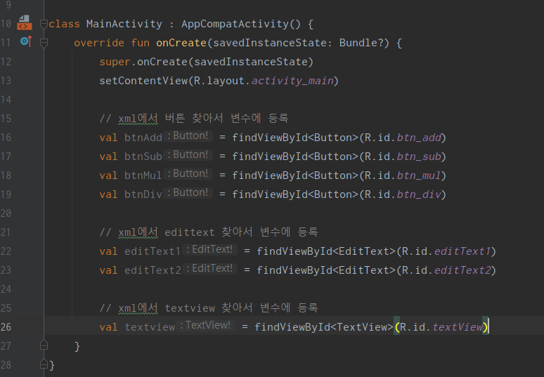
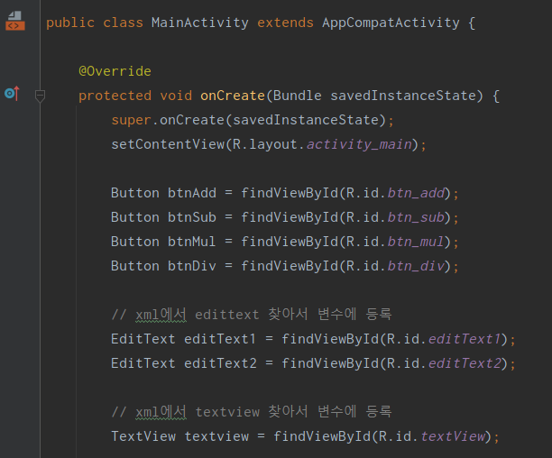
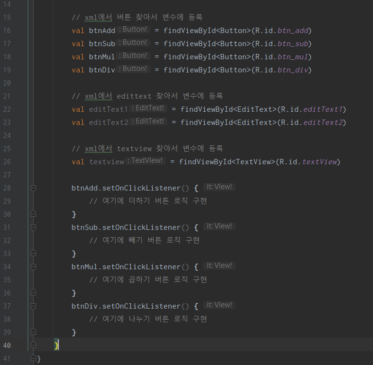
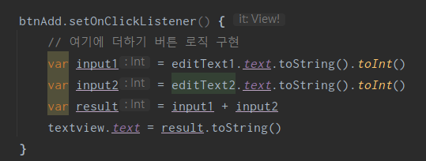
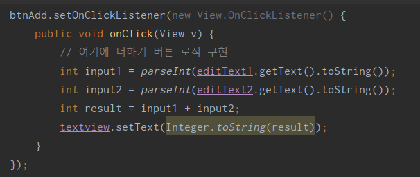
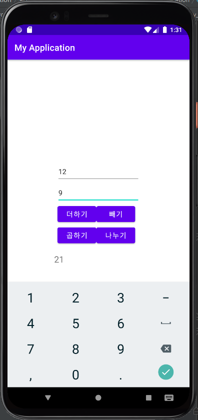

## 3주차 

### 계산기 레이아웃 작성 
  
3주차는 2주차 과제를 마쳤다는 가정 하에 이어서 진행한다.  
해당 경로에서 activity_main.xml 를 다운받거나 코드를 복사해서 붙여넣고 진행하면 된다.  
(예제코드를 본인 파일에 맞게 변수 이름을 수정하면서 따라해도 좋으나, 위 예시코드를 가지고 진행하는 걸 추천한다)  

위 화면은 ConstraintLayout과 TextView, EditText, Button 3가지 위젯을 이용하여 만들었다.  
이번 주차는 계산기 화면에 기능을 추가하여 3 위젯의 사용법을 알아보려고 한다.

---

### 기능
1. 단일 연산을 지원하는 계산기이다.
2. EditText는 입력창이라고 생각하면 된다. 여기서 숫자 두개를 각각 입력받는다.
3. 4개의 버튼은 각각 더하기, 빼기, 곱하기, 나누기 연산을 진행한다.
4. TextView는 결과창이다. 여기에 연산값이 출력된다.

---

### 버튼 등록
MainActivity.kt 파일로 이동하여 코드 작성을 시작한다.  
(설명은 kotlin 코드를 기준으로 작성되었으나, java도 동일한 흐름으로 이어지기 때문에 쭉 이어서 보면 좋겠다.)  

  

`onCreate` 라는 함수 아래에 코드를 작성하면 된다. 이는 Activity 생명주기에서 생성 단계에 한번 실행되는 함수로,  
쉽게 앱에서 어떤 화면이 처음 열릴 때 실행되는 함수라고 생각하면 된다. (현재는 activity.xml이 되겠다.)  

코드를 작성하면 `Button` 부분에 빨간 글씨로 문법 오류를 보여줄 것이다. 마우스로 해당 부분에 가져가면   

  

unresolved reference 라고 오류가 뜬다. 이는 Button에 관련된 library를 찾지 못했다는 오류이다.  
커서를 빨간 글씨에 올리고 Alt + Enter 단축키를 입력하거나 파란글씨의 Import 버튼을 클릭한다.  

(라이브러리란, 우리가 코드를 작성할 때 모든 코드를 직접 개발할 수 없기 때문에,  
많은 사람들이 자주 사용할만한 코드를 제공한다는 의미로 받아들이면 되겠다.  
예를 들자면 print 같은 함수도 편리하게 사용하도록 누군가 만들어놓고 제공하는 함수이다.)  

  

이제 문법 오류가 사라지고 정상적으로 보인다! 이어서 설명을 하자면  
`findViewById`는 View에서 Id를 통해 Button이나 TextView를 찾아서 가져온다.  
`MainActivity.kt`은 `activity_main.xml`에서 찾아올 것이고, 만약 화면이 하나 더 존재한다고 가정하면  
`SecondActivity.kt`는 `activity_second.xml`에서 찾아올 것이다.  
(물론 MainActivity같은 경우는 기본적으로 생성되어 따로 등록하고 연결할 필요가 없었지만,   
새로 화면을 작성할 때는 등록하고 연결해주는 간단한 세팅작업이 필요하다.)   

---

### 나머지 EditText, TextView 등록
  
위 코드처럼 등록해주자. Button과 정확히 동일하다.   

---

### Java 코드는?
  
자바도 방법은 동일하지만 코드 모습이 약간 다르겠다.  

---

### 버튼에 클릭 이벤트 리스너 등록하기
 
버튼에 클릭 이벤트를 등록하는 것은 간단하다. setOnClickListener만 작성해주면 된다.  
리스너란, 이벤트가 실행되면 감지하고 적절한 동작을 실행시켜주는 신호 감지 센서 같은거라고 생각하면 된다.  
클릭 뿐 아니라 롱클릭, 스와이프, 줌인/줌아웃 등 다양한 인터렉티브한 동작에 대해 반응하도록 작성할 수 있다.  

```kotlin
버튼.setOnClickListener(){
    // 여기에 작동할 동작 구현
}
```

(참고로 앞으로는 다음과 같이 코드블럭으로 설명할 예정이다. 아직까지는  
어디에 코드를 작성하는 지 익숙하지 않을 수 있으니 스크린샷으로 구성하였다.)  

이제 버튼 눌렀을 때 실행될 동작을 구현해보겠다.

---

### 리스너에 덧셈 동작 구현하기
  

editText와 TextView에서 값을 가져오고 넣어주는 간단한 함수를 호출해서 사용할 것이다.  
먼저, editText에서 값을 가져와서 더하는 소스를 작성한다.  

```kotlin
var input1 = editText1.text.toString().toInt()
var input2 = editText2.text.toString().toInt()
var result = input1 + input2
```

editText는 `.text.toString()`을 통해 문자열로 가져오고, 연산하기 위해 정수로 변환한다. `toInt()`  
해당 결과는 정수값 이므로 다시 `toString()`으로 문자열로 변환하여 TextView에 넣어줄 것이다.  
```kotlin
var result = input1 + input2
textview.text=result.toSting()
```
이렇게 정수<->문자열 등의 변환을 형변환 또는 Type Casting이라고 하는데, 자세한 내용은 구글링을 참고하자.  

---

### 모든 리스너에 연산 구현하기
   
방법은 동일하므로 똑같이 작성하면 되겠다.  

---

### Java 코드는?
  
  
자바도 방법은 동일하지만 코드 모습이 약간 다르겠다.  

---


### 실행 
   
이제 에뮬레이터를 열고 실행해보자. 정상적으로 작동하는 것을 확인할 수 있다.  

---

### 3주차 과제
두가지 과제 중 한가지를 택하여 제출해주시면 되겠습니다.
1. 기능적으로 코드 개선하기  
정수형을 실수형으로 바꿔서 실수 계산도 가능하게 수정하기, 나누셈에서 0으로 나누는 경우는 "0으로 나눌 수 없습니다!"를 결과창에 출력하기 등 다양한 방법 활용  

2. 코드 개선하기(리팩토링)    
Android에서 버튼을 등록하고 사용하는 방법은 다양합니다.  
또한 반복적이고 중복되는 부분이 많은 위와 같은 코드에서는 코드 길이를 더 줄일 수도 있습니다.  
이번 과제는 다른 방식으로 버튼을 구현해서 반복 코드를 줄이거나 버튼 내에서 사용되는 코드를 함수로 묶어서 코드 수를 줄이는 방법 등으로
코드 수를 줄여서 제출해주시면 되겠습니다. 제출은 `MainActivity.java` 또는 `MainActivity.kt` 단일 파일로 제출해주시면 됩니다.  
(Hint: 안드로이드 onclicklistener 등으로 검색해서 최신 자료 위주로 찾아보기)  

---

감사합니다😉


